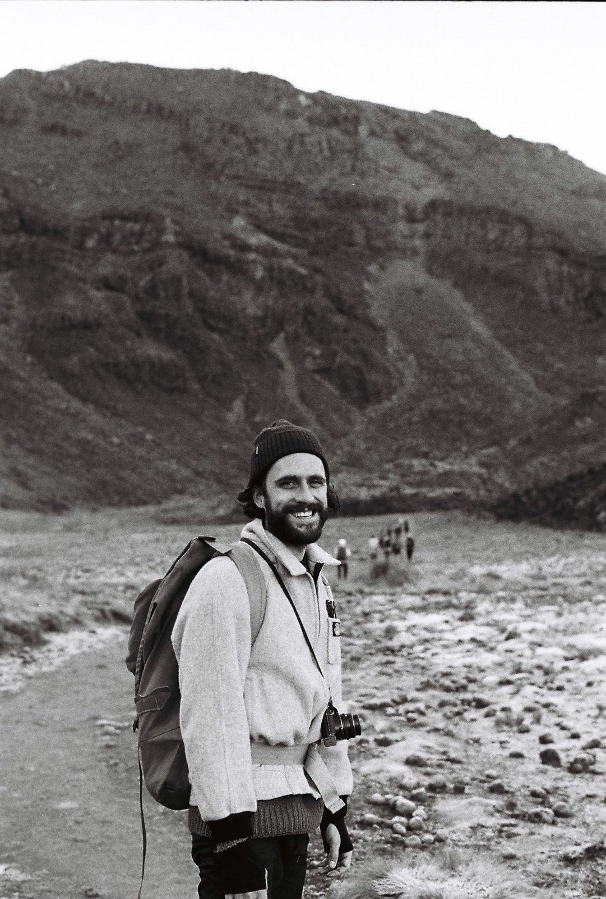

+++
title="Curriculum Vitae"
date="2022-05-22"
draft="true"
+++

I'm a full stack developer with 10+ years of management experience. Before moving back into tech, I managed a busy Certified Organic supermarket where I consistently achieved or surpassed my targets. My focus on leadership through collaboration has led to a reputation as an empathetic and effective manager. Through my exp{{ $image := .Resources.GetMatch "me_tongariro.jpeg" }}erience in Organics and all the challenges we face in food systems, I discovered a passion for problem-solving. Committed to using my skills to work in a dynamic and exciting field that allows me to tackle all kinds of new problems, big and small, I have transitioned back into tech.  

